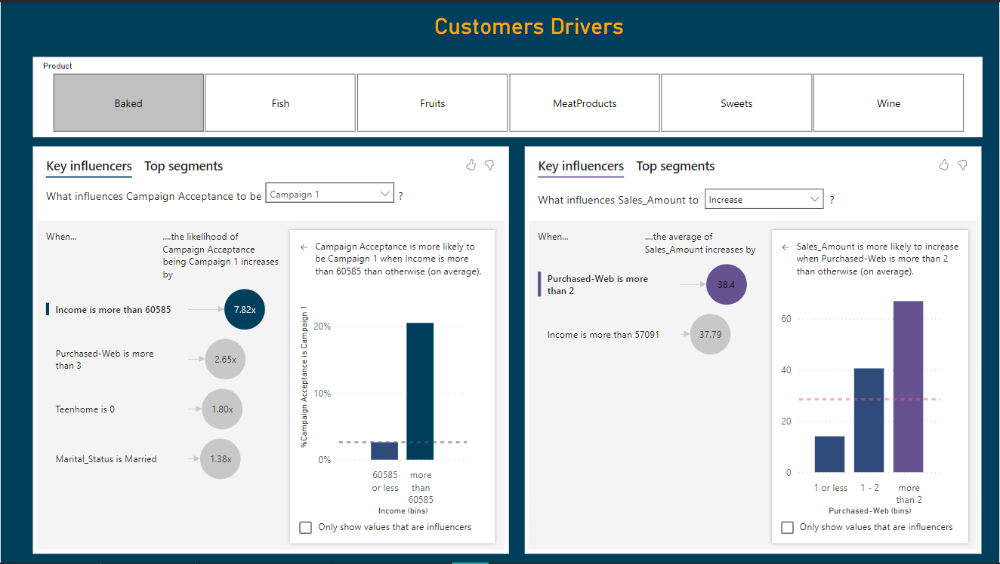

# Market Mindz Power BI Dashboard

## Project Overview
This Power BI dashboard provides actionable insights for **Market Mindz**, a fictional company. The dashboard aims to address key business questions related to marketing campaigns, product performance, customer demographics, and decision-making drivers. It is designed to help stakeholders understand their business and make data-driven decisions.

## Key Insights
The dashboard answers the following business questions:
1. **How are our six recent campaigns performing?**
   - Visuals showcase campaign ROI, conversion rates, and engagement metrics.
2. **How are our products performing?**
   - Performance metrics include sales trends, profitability, and product categories.
3. **Who are our customers?**
   - Salary, age, gender, purchasing behavior, kids number and marital status.
4. **What is driving campaign performance and buyer decision-making?**
   - Analysis of key influencers for the products and the Campaigns.

## Features
- **Interactive Visuals:** Drill-through capabilities for deeper insights.
- **Customizable Filters:** Filter by product categories, customer segments, or campaigns.
- **Performance Metrics:** KPIs for quick decision-making.

## Tools and Technologies Used
- **Power BI:** For creating the dashboard.
- **Dataset Source:** Fictional data created for the purpose of this project.
- **GitHub:** For version control and project sharing.

## Getting Started
Follow these steps to explore the dashboard:

### Prerequisites
1. Download and install [Power BI Desktop](https://powerbi.microsoft.com/desktop/).

### Installation
1. Clone this repository:
   ```bash
   git clone [https://github.com/abdelrahman-ehab/MarketMindz]
   ```
2. Open the `MarketMindz.pbix` file in Power BI Desktop.

## File Structure
```
Market-Mindz-Dashboard/
├── MarketMindzDashboard.pbix  # Power BI dashboard file
├── README.md                  # Project documentation
├── images/                    # Screenshots of the dashboard
└── data/                      # Dataset used (if permissible to share)
```

## Screenshots
### Campaign Performance View


### Buyer Composition View


### Customer Drivers


## Usage
- Use the slicers on the dashboard to filter the data by campaign, product category, or customer segment.
- Navigate between tabs to explore campaign performance, product metrics, customer insights, and decision-making drivers.

## Key Metrics
- **Campaign KPIs:** Conversion rate, ROI, engagement.
- **Product KPIs:** Total sales, profit margins, product popularity.
- **Customer Insights:** Top demographics, purchase behavior trends.
- **Decision Drivers:** Key factors influencing performance.

## Lessons Learned
Creating this dashboard provided hands-on experience with:
- Designing user-friendly visualizations in Power BI.
- Translating business questions into measurable KPIs.
- Structuring data for impactful storytelling.

## Future Improvements
- Integrate real-world datasets.
- Add advanced analytics like predictive modeling.
- Publish the dashboard to Power BI Service for online sharing.


## Contact
For questions or feedback, please contact:
- **Your Name**: [Abdelrahman Ehab](mailto:rahman.ihab1@gmail.com)
- [GitHub Profile](https://github.com/yourusername)

